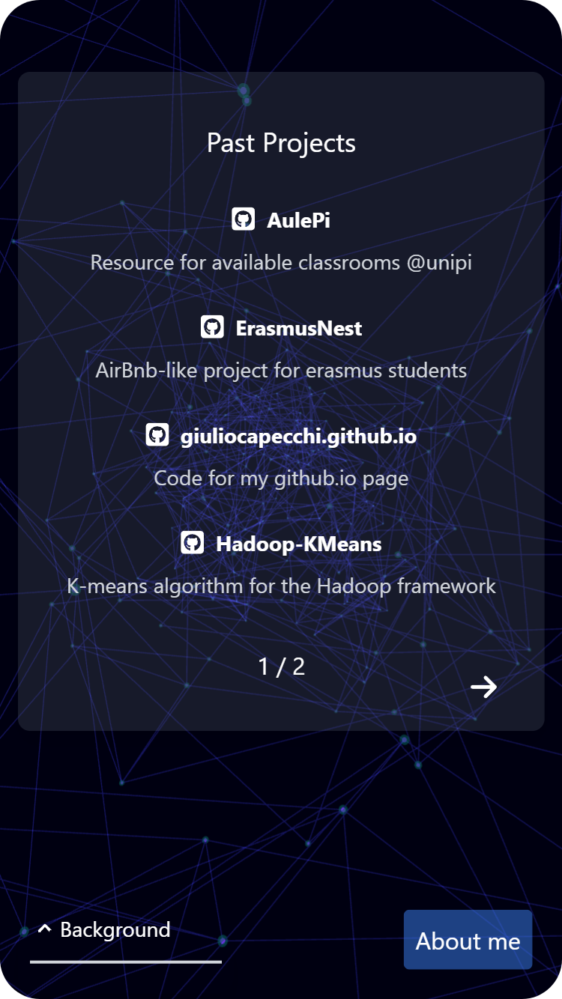

# Personal Page

Code for my githubpage, featuring some [Three.js](https://threejs.org/ "Three.js") custom-made scenes.

<p align="center">
    
      
</p>

## Features

- Interactive 3D scenes using Three.js
- Responsive design for mobile and desktop
- Dynamic content loading
- Portfolio section with GitHub repositories
- Background controls to switch between different 3D scenes

## Technologies Used

- [Next.js](https://nextjs.org/)
- [Three.js](https://threejs.org/)
- [Tailwind CSS](https://tailwindcss.com/)

<p align="center">
    
    
</p>


</div>


## Cloning the repository

To set up the project locally, follow these steps:

1. Clone the repository:
    ```sh
    git clone https://github.com/giuliocapecchi/giuliocapecchi.github.io
    cd giuliocapecchi.github.io
    ```

2. Install the dependencies:
    ```sh
    npm install
    ```

3. Finally, use the following command to run the developement server on localhost:3000: 
    ```sh
    npm run dev
    ```
